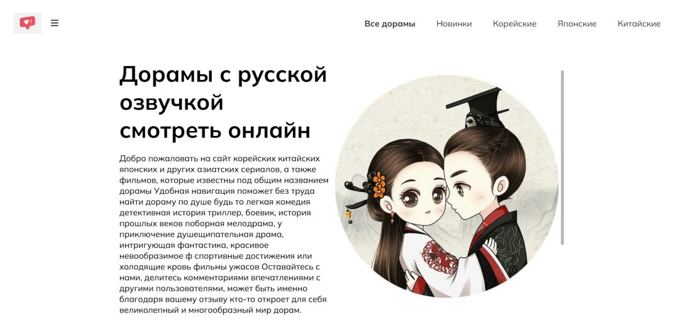
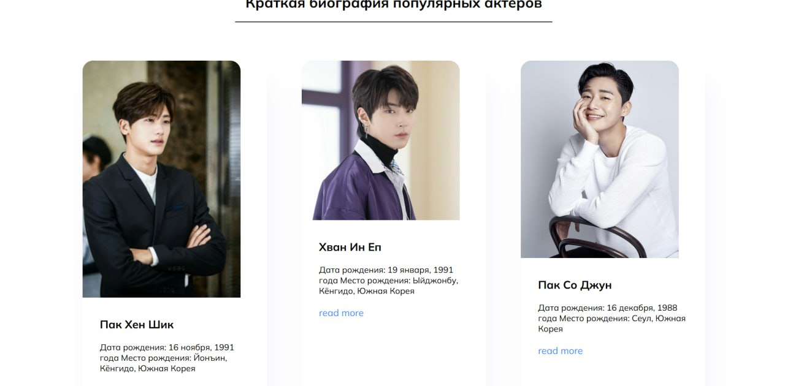
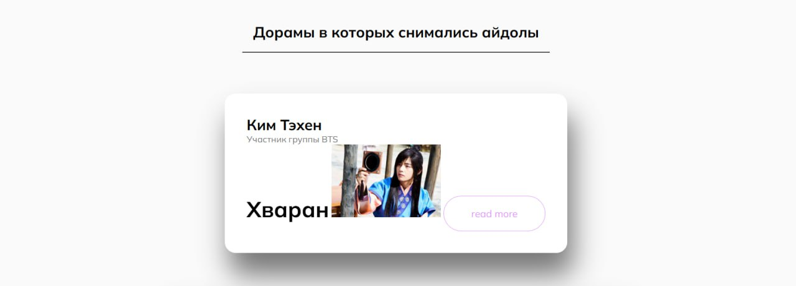

# Сайт для просмотра информации по дорамам и их актеров

## Описание проекта
Это личный учебный проект для демонтсрации навыков HTML и CSS. На сайте есть различные промо фильмов, описания этих фильмов и актеров дорам.

## Скриншоты сайта





## Основные функции
- Удобная навигация по сайту
- Адаптивный дизайн

## Технологии
- HTML5
- CSS3
- Font Awesome 4.7.0
- SCSS/LESS

## Структура проекта
```
project/
├── index.html          # Главная страница
├── style.css          # Основные стили
├── less/              # LESS файлы
├── scss/              # SCSS файлы
├── css/               # Скомпилированные CSS файлы
├── fonts/             # Шрифты
├── font-awesome-4.7.0/ # Иконки Font Awesome
└── images/            # Изображения
```

## Установка и запуск
1. Клонируйте репозиторий
2. Откройте файл `index.html` в веб-браузере

## Разработка
Проект использует препроцессоры SCSS/LESS для стилей. Для компиляции стилей рекомендуется использовать соответствующие инструменты сборки.